<p align="center">
  <h1 align="center">Food Lagbe (ফুড লাগবে)</h1>
  <p align="center">
    A full-stack food delivery platform for Bangladesh — order, cook, deliver, manage.
    <br />
    <a href="https://food-lagbe.vercel.app"><strong>View Live Demo &rarr;</strong></a>
    <br />
    <br />
    <a href="https://food-lagbe.vercel.app">Live Site</a>
    &middot;
    <a href="https://github.com/mazbha-37/FoodLagbe/issues">Report Bug</a>
    &middot;
    <a href="https://github.com/mazbha-37/FoodLagbe/issues">Request Feature</a>
  </p>
</p>

---

Built with the **MERN stack** — customers browse restaurants and track deliveries in real time, restaurant owners manage menus and orders, riders handle pickups with live GPS, and admins oversee the entire platform.

## Screenshots

<details>
<summary><b>Customer Interface</b> (click to expand)</summary>
<br />

| Homepage | Checkout |
|:---:|:---:|
| 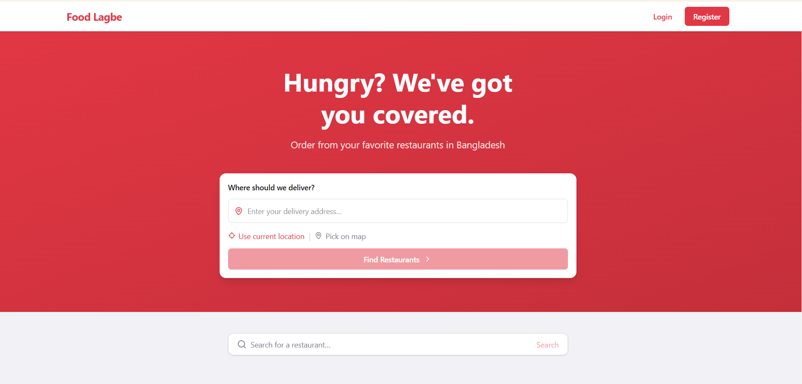 | 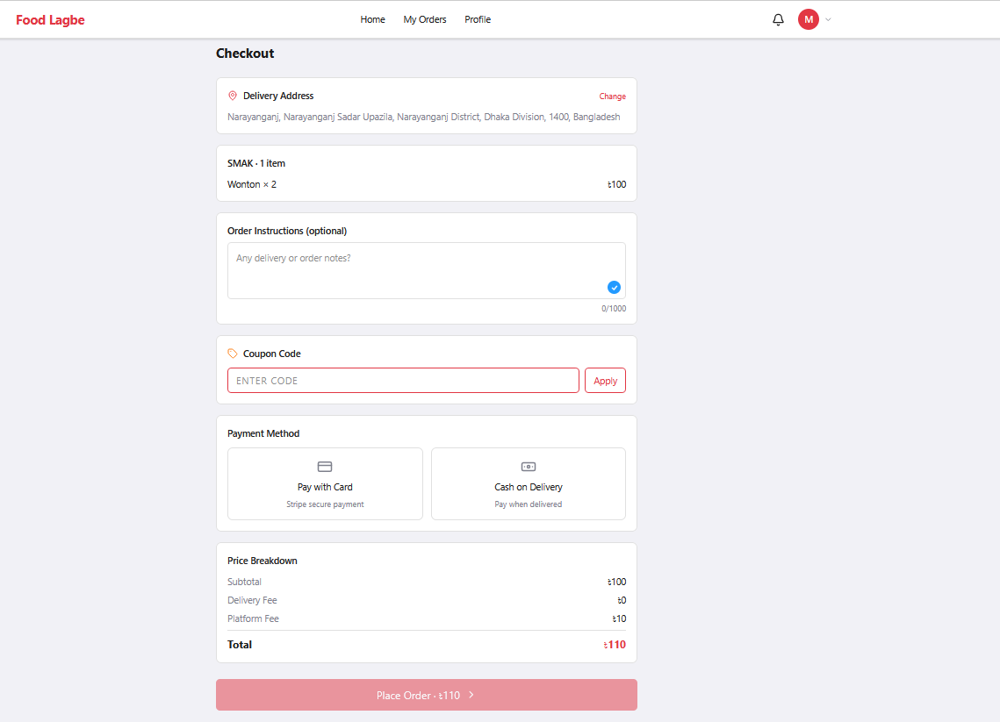 |
| _Location-based restaurant search_ | _Order with delivery address, coupon & payment_ |

| Order Complete |
|:---:|
| 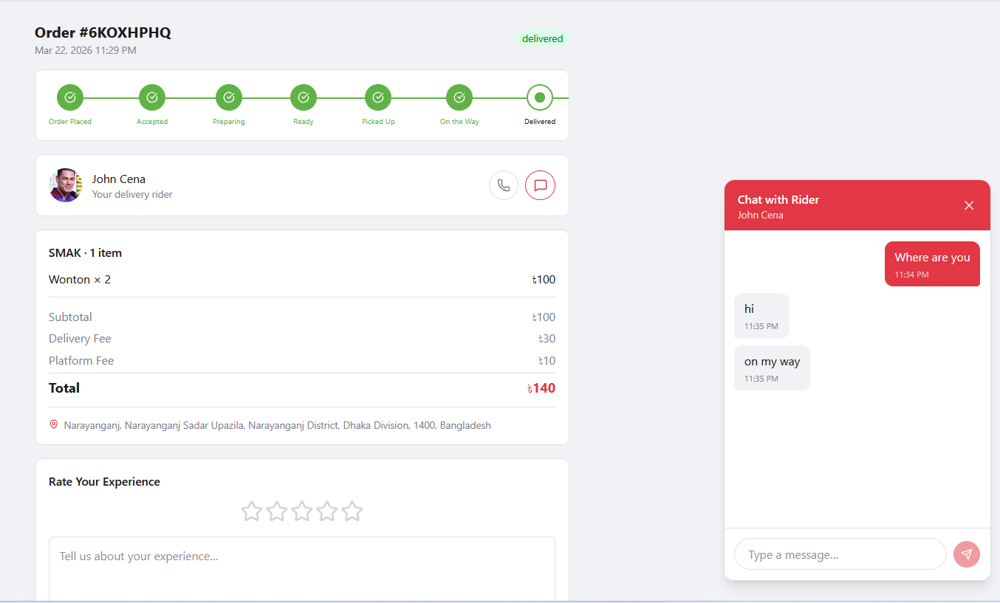 |
| _Status timeline, rider chat, and review system_ |

</details>

<details>
<summary><b>Restaurant Dashboard</b> (click to expand)</summary>
<br />

| Menu Management | Add Menu Item |
|:---:|:---:|
| 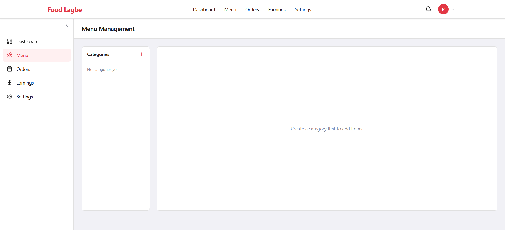 | 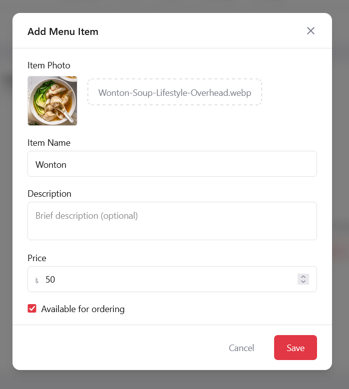 |
| _Categories and items overview_ | _Photo upload, description, pricing_ |

| Order Management |
|:---:|
| 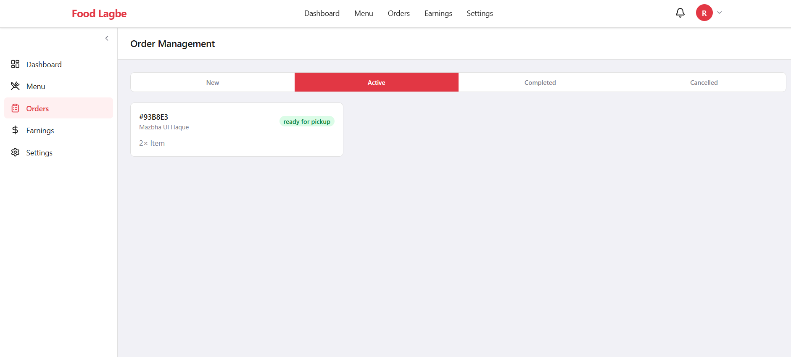 |
| _New, Active, Completed, and Cancelled tabs_ |

</details>

<details>
<summary><b>Rider Interface</b> (click to expand)</summary>
<br />

| Application | Dashboard |
|:---:|:---:|
| 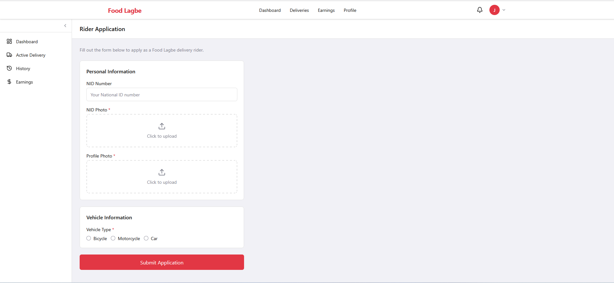 | 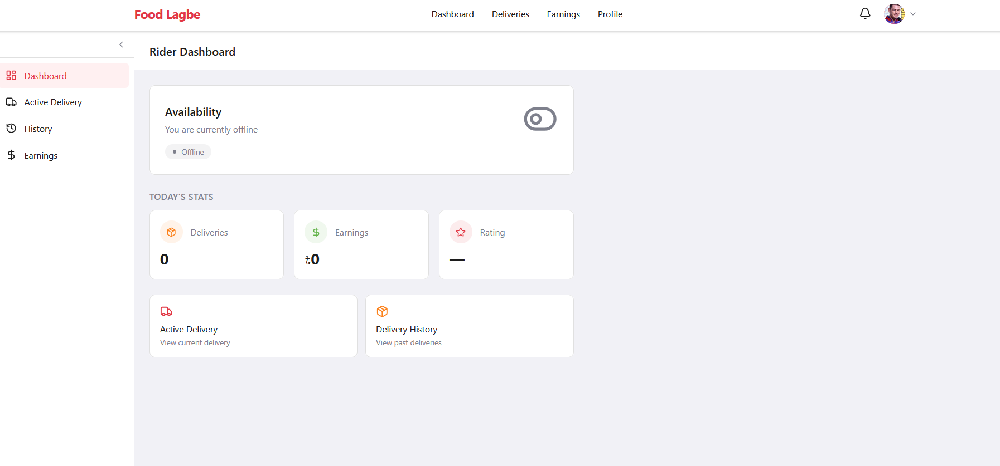 |
| _NID, photo upload, vehicle info_ | _Availability toggle & today's stats_ |

| Active Delivery | Delivery History |
|:---:|:---:|
| 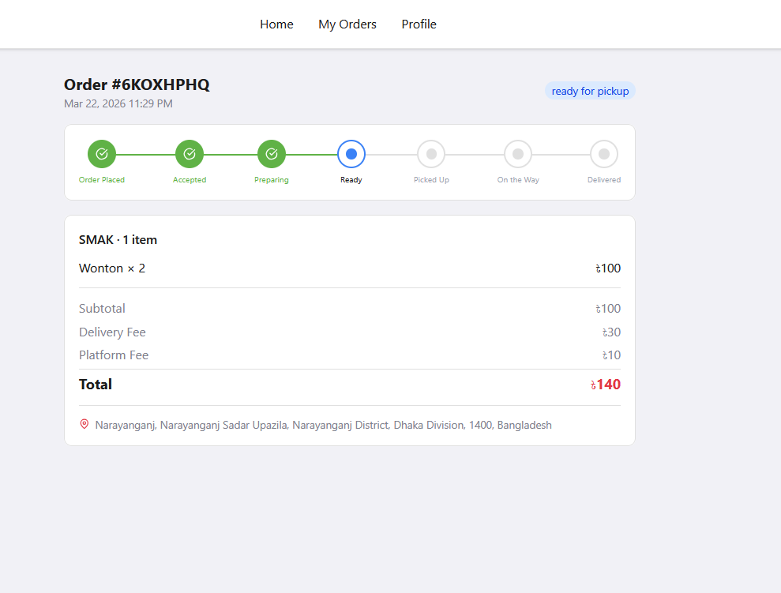 |  |
| _Live GPS map & delivery status_ | _Completed orders with earnings_ |

</details>

<details>
<summary><b>Admin Dashboard</b> (click to expand)</summary>
<br />

| Dashboard | Restaurant Applications |
|:---:|:---:|
|  | 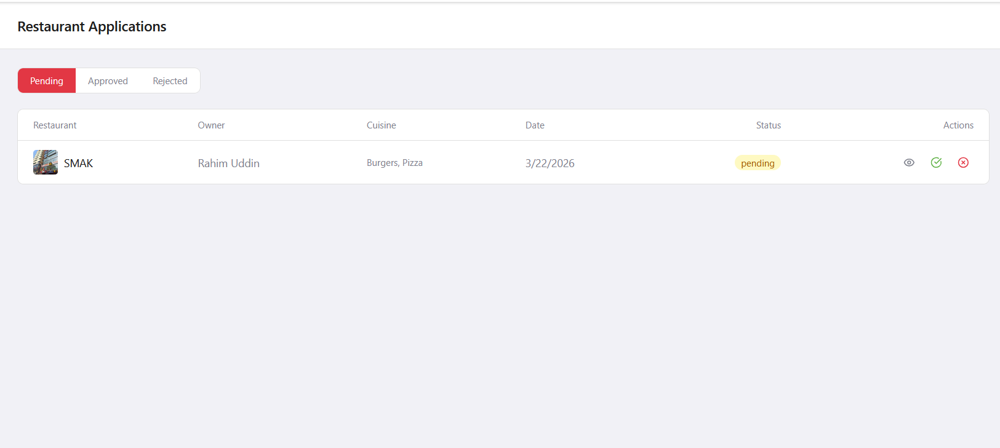 |
| _Platform analytics & order charts_ | _Review & approve restaurants_ |

| Rider Applications |
|:---:|
| 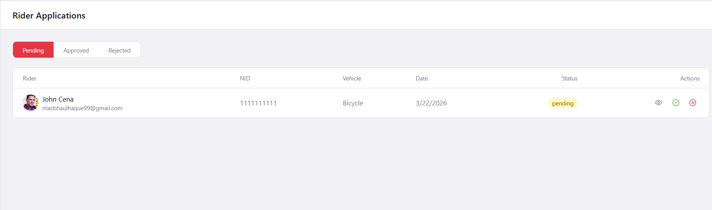 |
| _Approve or reject rider applications_ |

</details>

## Features

<table>
<tr>
<td width="50%" valign="top">

### Customer
- Browse nearby restaurants with location search
- Search by restaurant name or cuisine
- View menus with categories
- Cart with special instructions
- Stripe payment integration
- Real-time order tracking with live map
- Live chat with rider
- Order history & reordering
- Rate and review restaurants
- File complaints
- Apply coupon codes
- Profile management

</td>
<td width="50%" valign="top">

### Restaurant Owner
- Apply to register (admin-approved)
- Dashboard with stats & earnings charts
- Full menu management (categories, items, images)
- Real-time new order notifications with sound
- Accept/reject orders
- Update status (preparing &rarr; ready for pickup)
- Restaurant settings
- Earnings tracking (daily/weekly/monthly)

</td>
</tr>
<tr>
<td width="50%" valign="top">

### Rider
- Apply as rider (admin-approved)
- Toggle availability on/off
- Auto-assignment by nearest distance
- Active delivery with route map
- Status updates (picked up &rarr; on the way &rarr; delivered)
- Live GPS broadcasting
- Chat with customer
- Delivery history & earnings dashboard

</td>
<td width="50%" valign="top">

### Admin
- Platform-wide analytics dashboard
- Approve/reject restaurant applications
- Approve/reject rider applications
- User management (view, suspend)
- Order oversight across restaurants
- Complaint management & resolution
- Coupon creation & management

</td>
</tr>
</table>

### Platform Highlights

| Feature | Description |
|---|---|
| Real-time | Socket.IO for notifications, chat, live tracking |
| Authentication | JWT with refresh tokens (30-day sessions) |
| Authorization | Role-based access (customer, restaurant_owner, rider, admin) |
| Payments | Stripe checkout with webhook verification |
| Maps | Leaflet for location picking & delivery tracking |
| Images | Cloudinary uploads with compression |
| Security | Helmet, CORS, rate limiting, data sanitization |
| API Docs | Swagger UI at `/api-docs` (dev mode) |

## Tech Stack

<table>
<tr>
<td valign="top" width="50%">

### Frontend
| Technology | Version |
|---|---|
| React | 19.2 |
| Vite | 8.0 |
| Redux Toolkit (RTK Query) | 2.11 |
| React Router | 7.13 |
| Tailwind CSS | 4.2 |
| Socket.IO Client | 4.8 |
| Leaflet + React Leaflet | 1.9 / 5.0 |
| Recharts | 3.8 |
| React Hook Form + Zod | 7.71 / 4.3 |
| Lucide React | 0.577 |
| date-fns | 4.1 |

</td>
<td valign="top" width="50%">

### Backend
| Technology | Version |
|---|---|
| Node.js | 20+ |
| Express | 5.2 |
| MongoDB + Mongoose | 7+ / 9.3 |
| Socket.IO | 4.8 |
| JSON Web Tokens | 9.0 |
| Stripe | 20.4 |
| Cloudinary | 2.9 |
| Joi (validation) | 18.0 |
| Swagger (jsdoc + UI) | 6.2 / 5.0 |
| Helmet / CORS / HPP | 8.1 / 2.8 / 0.2 |
| Winston (logging) | 3.19 |
| node-cron | 4.2 |

</td>
</tr>
</table>

## Getting Started

### Prerequisites

- **Node.js** >= 20
- **MongoDB** >= 7 (local or [Atlas](https://www.mongodb.com/cloud/atlas))
- **npm** >= 9
- [Stripe](https://stripe.com) account (payments)
- [Cloudinary](https://cloudinary.com) account (image uploads)

### 1. Clone the repository

```bash
git clone https://github.com/mazbha-37/FoodLagbe.git
cd FoodLagbe
```

### 2. Install all dependencies

```bash
npm run install:all
```

### 3. Set up environment variables

```bash
cp server/.env.example server/.env
```

Edit `server/.env`:

| Variable | Description | Example |
|---|---|---|
| `NODE_ENV` | Environment mode | `development` |
| `PORT` | Server port | `5000` |
| `MONGODB_URI` | MongoDB connection string | `mongodb://localhost:27017/foodlagbe` |
| `JWT_ACCESS_SECRET` | Secret for access tokens | Any secure random string |
| `JWT_REFRESH_SECRET` | Secret for refresh tokens | Different secure random string |
| `JWT_ACCESS_EXPIRY` | Access token lifespan | `1h` |
| `JWT_REFRESH_EXPIRY` | Refresh token lifespan | `30d` |
| `CLOUDINARY_CLOUD_NAME` | Cloudinary cloud name | From Cloudinary dashboard |
| `CLOUDINARY_API_KEY` | Cloudinary API key | From Cloudinary dashboard |
| `CLOUDINARY_API_SECRET` | Cloudinary API secret | From Cloudinary dashboard |
| `STRIPE_SECRET_KEY` | Stripe secret key | `sk_test_...` |
| `STRIPE_WEBHOOK_SECRET` | Stripe webhook signing secret | `whsec_...` |
| `CLIENT_URL` | Frontend URL (for CORS) | `http://localhost:5173` |
| `ADMIN_EMAIL` | Default admin email (seed) | `admin@foodlagbe.com` |
| `ADMIN_PASSWORD` | Default admin password (seed) | `Admin@1234` |

Create `client/.env`:

```env
VITE_API_URL=http://localhost:5000/api/v1
VITE_SOCKET_URL=http://localhost:5000
```

### 4. Start MongoDB

```bash
mongod
# Or use MongoDB Atlas (update MONGODB_URI in server/.env)
```

### 5. Seed the database

```bash
cd server
npm run seed:admin    # Creates default admin user
npm run seed:data     # Populates sample restaurants, menus, etc.
cd ..
```

### 6. Run the application

```bash
npm run dev
```

| Service | URL |
|---|---|
| Frontend | http://localhost:5173 |
| Backend API | http://localhost:5000/api/v1 |
| API Docs | http://localhost:5000/api-docs |
| Health Check | http://localhost:5000/api/v1/health |

## API Routes

| Prefix | Description |
|---|---|
| `/api/v1/auth` | Register, login, logout, refresh token, forgot/reset password |
| `/api/v1/users` | User profile management |
| `/api/v1/restaurants` | Browse restaurants, restaurant CRUD |
| `/api/v1/restaurants/:id/categories` | Menu category management |
| `/api/v1/restaurants/:id/categories/:catId/items` | Menu item management |
| `/api/v1/cart` | Cart operations (add, update, remove, clear) |
| `/api/v1/orders` | Place orders, update status, track, messages |
| `/api/v1/riders` | Rider profile, availability, active delivery, earnings |
| `/api/v1/coupons` | Coupon validation and management |
| `/api/v1/complaints` | File and manage complaints |
| `/api/v1/notifications` | User notifications |
| `/api/v1/admin` | Admin dashboard, approvals, user management |
| `/api/v1/webhooks` | Stripe webhook handler |

## Project Structure

```
FoodLagbe/
├── client/                        # React frontend (Vite)
│   ├── public/                    # Static assets (favicon, icons)
│   ├── src/
│   │   ├── app/                   # Redux store & base API slice
│   │   ├── components/
│   │   │   ├── layout/            # Navbar, Footer, DashboardLayout
│   │   │   ├── map/               # Leaflet map components
│   │   │   └── ui/                # Button, Modal, Badge, Input, etc.
│   │   ├── features/
│   │   │   ├── admin/             # Admin dashboard & management
│   │   │   ├── auth/              # Login, Register, auth state
│   │   │   ├── chat/              # Real-time chat panel
│   │   │   ├── customer/          # Home, restaurants, cart, checkout, tracking
│   │   │   ├── notifications/     # Notification bell & API
│   │   │   ├── restaurant/        # Restaurant dashboard, menu, orders
│   │   │   └── rider/             # Rider dashboard, delivery, earnings
│   │   ├── hooks/                 # Custom hooks (useSocket)
│   │   ├── routes/                # Route config, guards
│   │   ├── socket/                # Socket.IO client
│   │   └── utils/                 # Helpers (currency, date, distance)
│   └── vite.config.js
│
├── server/                        # Express backend
│   ├── seed/                      # Database seed scripts
│   ├── src/
│   │   ├── config/                # DB, Cloudinary, Stripe, Socket
│   │   ├── controllers/           # 15 route handlers
│   │   ├── jobs/                  # Cron jobs (order timeout)
│   │   ├── middleware/            # Auth, roles, errors, rate limit, upload
│   │   ├── models/                # 13 Mongoose schemas
│   │   ├── routes/                # 13 Express route files
│   │   ├── services/              # Rider assignment, fees, notifications
│   │   ├── socket/                # Socket.IO auth & event handlers
│   │   ├── utils/                 # AppError, catchAsync, haversine
│   │   └── validators/            # Joi request validators
│   └── server.js                  # Entry point (HTTP + WebSocket)
│
├── screentshoot/                  # App screenshots
├── render.yaml                    # Render deployment config
└── package.json                   # Root scripts (dev, install:all)
```

## Deployment

The app is deployed on:

| Service | Purpose | URL |
|---|---|---|
| **Vercel** | Frontend hosting | [food-lagbe.vercel.app](https://food-lagbe.vercel.app) |
| **Render** | Backend API + WebSocket | Free tier web service |
| **MongoDB Atlas** | Database | Free M0 cluster |
| **Cloudinary** | Image storage | Free tier |

### Deploy Your Own

**Frontend (Vercel):** Import repo &rarr; Root Directory: `client` &rarr; Framework: Vite &rarr; Add env vars &rarr; Deploy

**Backend (Render):** New Web Service &rarr; Root Directory: `server` &rarr; Build: `npm install` &rarr; Start: `node server.js` &rarr; Add env vars &rarr; Deploy

## Contributing

1. Fork the repository
2. Create a feature branch: `git checkout -b feature/your-feature`
3. Commit your changes: `git commit -m 'Add your feature'`
4. Push to the branch: `git push origin feature/your-feature`
5. Open a Pull Request

## License

This project is licensed under the [MIT License](LICENSE).

---

<p align="center">
  Made with dedication for the streets of Bangladesh
</p>
